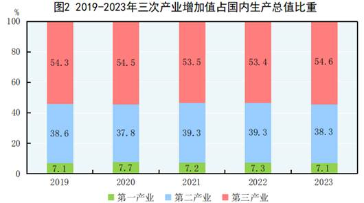

> [国家统计局年鉴](https://www.stats.gov.cn/sj/ndsj/)
>
> [国务院政策文件库](https://sousuo.www.gov.cn/zcwjk/policyDocumentLibrary?q=&t=zhengcelibrary&orpro=)

## 同比和环比

**增长速度**是反映**经济社会某一领域发展变化情况**的重要指标，而**同比**和**环比**是反映增长速度最基础、最核心的指标，也是国际上通用的指标。在统计中，同比和环比通常是**同比变化率**和**环比变化率**的简称，用于表示某一事物在对比期内发展变化的方向和程度。

**同比**是以上年同期为基期相比较，即**本期**某一时间段（点）与**上年**某一时间段（点）相比，可以理解为**今年第n月**与**去年第n月**的比较。同比增长率是指本期和上一年同期相比较的增长率，计算公式为：同比增长率＝（本期数－同期数）/同期数×100％。例如，某公司2022年上半年利润3000万元，为本期数，上年同期数是2021年上半年的利润2000万元，同比增长率为（3000－2000）/2000×100％＝50％，即某公司2022年上半年利润同比增长50％。

**环比**是与上一个相邻统计周期相比较，表明统计指标逐期的发展变化，可以理解为**第n月**与**第n－1月**的比较。环比增长率是指**本期**和**上期**相比较的增长率，计算公式为：环比增长率＝（本期数－上期数）/上期数×100％。例如，某公司2022年6月份营业收入额为100万元，为本期数，上期数是2022年5月份营业额80万元，环比增长率为（100－80）/80×100％＝25％，即某公司2022年6月份营业额环比增长25％。

**环比**侧重反映数据的**短期变化**。用环比增长速度反映指标变化时，时效性强，比较灵敏。比如，对居民消费价格指数（CPI）的环比涨跌幅进行分析，可以判断短期内物价变化的方向（上升或下降）。环比的不足之处是，对一些随着季节变化而波动的指标，将当期的数据直接与上期相比时，容易受到**季节因素的干扰**，使得用其反映的增长速度波动往往较大。比如，由于“双十一”促销影响，11月份网上零售额相比10月份增加较多，而12月份网上零售额相比11月份会减少较多，相应地，11月份的环比增长速度会比较高，而12月份的环比增长速度就可能是负的，但这并不能说明网上零售额发生了趋势性变化。所以进行环比计算之前一般需要先把经济指标变动中的季节性因素剔除掉，即进行季节调整后，再计算环比增长速度。

**同比**相对于环比，侧重反映**长期趋势**，能够一定程度上克服季节性波动的影响。比如，同样是“双十一”促销，使用同比增长速度，10月、11月、12月的网上零售额增速波动不会像环比波动那样大，主要由于上年与今年11月“双十一”促销因素均存在。但另一方面，同比增长速度的缺点是易于受基期因素影响，比如，上年基期受灾害影响，数据波动大，而今年同期未受灾害影响，则同比增长速度会表现出波动变化。

总之，同比和环比所反映的虽然都是变化速度，但由于对比基期不同，反映的内涵不同。一般来说，环比可以与环比相比较，而不能拿同比与环比相比较。但是，对于同一个领域，当既要考虑历史发展趋势，又要考虑短期变化时，则应把同比与环比放在一起进行对照分析。

## 第一、第二、第三产业

“第一产业”、“第二产业”和“第三产业”是中国国民经济的三大产业划分，分别代表不同的经济活动类型。

第一产业主要指农业、林业、牧业和渔业等直接利用自然资源的产业。
* 定义:直接利用自然资源，从事农、林、牧、渔等生产活动的产业。
* 主要包括:种植业、林业、畜牧业、渔业等。
* 特点:以获取自然资源为基础，产品多为初级产品。

第二产业主要指采矿业、制造业、电力、燃气及水的生产和供应业，以及建筑业等，这些产业对原材料进行加工，生产出制成品。

* 定义:对第一产业提供的原材料进行加工，生产出制成品或进行能源生产的产业。
* 主要包括:采矿业、制造业、电力、热力、燃气及水的生产和供应业，建筑业等。
* 特点:以工业生产活动为主，是国民经济发展的重要支柱。

第三产业则包括除第一和第二产业以外的其他所有行业，主要提供各种服务，如批发零售、交通运输、金融、教育、医疗等。

