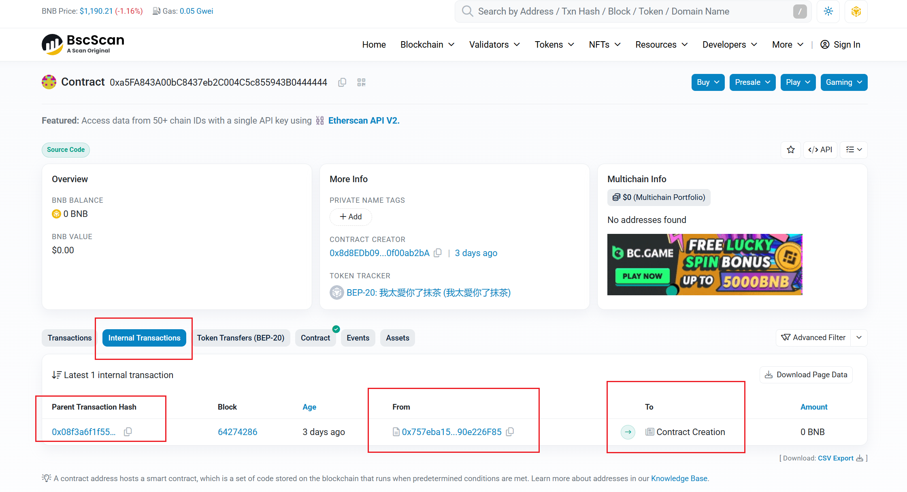
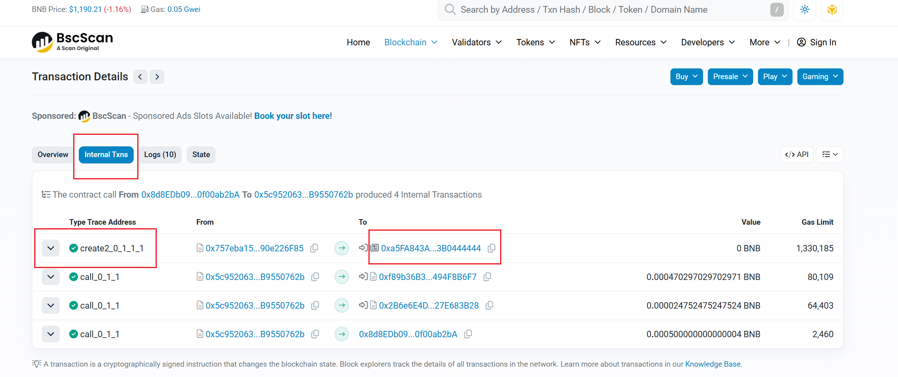

## 为什么要做这个
* Python的web3库的练习
* 最近BSC的MEME很火，写这个工具玩一玩

## 工具准备
* Python
* [Etherscan官网注册获取免费API](https://etherscan.io/apis)

## 设计思路
* 在[BSC浏览器](https://bscscan.com/)里查看[FOUR](https://four.meme/zh-TW)平台发射出来的代币，发现其代币的智能合约是通过工厂模式创建的。


* 很容易找到FOUR的工厂合约地址： `0x5c952063c7fc8610FFDB798152D69F0B9550762b`


* 查看这条哈希，然后在 `Internal Txns` 内部交易中找到CREATE方法的调用，就说明这笔交易创建了一个新代币，在交易的 `To` 值里，找到新代币的合约地址。


* 所以代码的执行思路：

1.轮询BSC的区块，找到 `To` 是FOUR工厂合约的哈希。

2.提取每个哈希里的 `Internal Txns` 交易，如果里面有CREATE方法的调用，那么这次交易则创建了一个新代币，代币的合约地址就是 `To` 的地址。

3.调用代币合约的方法，获得代币的名称。

## 代码实现

轮询区块，找到 `To` 为工厂合约的哈希

```python
for tx in block['transactions']:
    if tx['to'] and tx['to'] == FACTORY_ADDRESS:
        txStr = '0x' + str(tx['hash'].hex())
        print(f"检查交易:{txStr}")
        new_addrs, error = v2_internal_txns(txStr)
```

检查哈希的 `Internal Txns` 里是否有CREATE的函数调用，如果有，获取 `To` 的合约即为新代币合约地址

```python
def v2_internal_txns(tx_hash, use_batch=False):
    """使用Etherscan V2 API获取Internal TXNs（chainid=56）"""
    url = "https://api.etherscan.io/v2/api"  # V2统一端点
    ...
    else:
        # 单tx
        params = {
            'chainid': 56,
            'module': 'account',
            'action': 'txlistinternal',
            'txhash': tx_hash,
            'apikey': ETHERSCAN_API_KEY
        }
    
    try:
        response = requests.get(url, params=params)
        print(f"DEBUG: V2 URL: {url}, 状态码: {response.status_code}")
        print(f"DEBUG: 响应内容: {response.text[:300]}...")  # 截断调试
        
        if response.status_code != 200:
            return [], f"HTTP {response.status_code}: {response.text}"
        
        data = response.json()
        if data.get('status') == '1' and 'result' in data:
            new_addresses = []
            for txn in data['result']:
                contractAddr = txn.get('contractAddress', '')  # e.g., "create2_0_1_1_1"
                txn_type = txn.get('type', '').lower()
                to_addr = txn.get('to', '')
                if txn_type == 'create2' and to_addr == '' and contractAddr:
                    new_addresses.append(Web3.to_checksum_address(contractAddr))
            return new_addresses, None
        else:
            return [], f"API错误: {data.get('message', '未知')}"
    except json.JSONDecodeError as e:
        return [], f"JSON解析失败 (可能是404/非JSON): {response.text[:100]} - {str(e)}"
    except Exception as e:
        return [], f"V2 API调用失败: {str(e)}"
```

检查代币的合约地址，获取代币的名字
```python
def is_bep20_token(contract_address):
    """验证BEP-20代币"""
    try:
        if w3.eth.get_code(contract_address) == '0x':
            return False, "非合约地址"
        contract = w3.eth.contract(address=contract_address, abi=BEP20_ABI)
        name = contract.functions.name().call()
        symbol = contract.functions.symbol().call()
        return True, f"{symbol} ({name})"
    except Exception as e:
        return False, f"非BEP-20或调用失败: {str(e)}"
```

完整代码如下，其中`ETHERSCAN_API_KEY`需要更换成自己的API Key，去这里注册[Etherscan官网注册获取免费API](https://etherscan.io/apis)

```python
from web3 import Web3
from web3.middleware import ExtraDataToPOAMiddleware
import time
import json
import requests
from hexbytes import HexBytes

# BSC RPC（测试debug_trace支持；若失败，换Ankr: https://rpc.ankr.com/bsc）
RPC_URL = 'https://bsc-dataseed1.binance.org/'  # 或 'https://bsc.rpc.blxrbdn.com/' 支持trace
w3 = Web3(Web3.HTTPProvider(RPC_URL))

# 添加POA中间件,因为BSC有一部分POA网络血统,需要添加POA中间件
w3.middleware_onion.inject(ExtraDataToPOAMiddleware, layer=0) 

# BEP-20验证ABI
BEP20_ABI = [
    {"constant": True, "inputs": [], "name": "name", "outputs": [{"name": "", "type": "string"}], "type": "function"},
    {"constant": True, "inputs": [], "name": "symbol", "outputs": [{"name": "", "type": "string"}], "type": "function"}
]

# FORM工厂地址
FACTORY_ADDRESS = '0x5c952063c7fc8610FFDB798152D69F0B9550762b'

# Etherscan/BscScan V2 API Key（免费：https://etherscan.io/myapikey 或 bscscan.com/myapikey）
ETHERSCAN_API_KEY = ''  # 共享key

# BEP-20验证ABI
BEP20_ABI = [
    {"constant": True, "inputs": [], "name": "name", "outputs": [{"name": "", "type": "string"}], "type": "function"},
    {"constant": True, "inputs": [], "name": "symbol", "outputs": [{"name": "", "type": "string"}], "type": "function"}
]

def is_bep20_token(contract_address):
    """验证BEP-20代币"""
    try:
        if w3.eth.get_code(contract_address) == '0x':
            return False, "非合约地址"
        contract = w3.eth.contract(address=contract_address, abi=BEP20_ABI)
        name = contract.functions.name().call()
        symbol = contract.functions.symbol().call()
        return True, f"{symbol} ({name})"
    except Exception as e:
        return False, f"非BEP-20或调用失败: {str(e)}"

def v2_internal_txns(tx_hash, use_batch=False):
    """使用Etherscan V2 API获取Internal TXNs（chainid=56）"""
    url = "https://api.etherscan.io/v2/api"  # V2统一端点
    if use_batch:
        # 批量：用address + 区块范围（更高效，避免单tx 404）
        params = {
            'chainid': 56,  # BSC
            'module': 'account',
            'action': 'txlistinternal',
            'address': FACTORY_ADDRESS,  # 工厂地址
            'startblock': '0',
            'endblock': 'latest',  # 或指定recent block
            'page': 1,
            'offset': 10,  # 最近10笔
            'sort': 'desc',
            'apikey': ETHERSCAN_API_KEY
        }
    else:
        # 单tx
        params = {
            'chainid': 56,
            'module': 'account',
            'action': 'txlistinternal',
            'txhash': tx_hash,
            'apikey': ETHERSCAN_API_KEY
        }
    
    try:
        response = requests.get(url, params=params)
        print(f"DEBUG: V2 URL: {url}, 状态码: {response.status_code}")
        print(f"DEBUG: 响应内容: {response.text[:300]}...")  # 截断调试
        
        if response.status_code != 200:
            return [], f"HTTP {response.status_code}: {response.text}"
        
        data = response.json()
        if data.get('status') == '1' and 'result' in data:
            new_addresses = []
            for txn in data['result']:
                contractAddr = txn.get('contractAddress', '')  # e.g., "create2_0_1_1_1"
                txn_type = txn.get('type', '').lower()
                to_addr = txn.get('to', '')
                if txn_type == 'create2' and to_addr == '' and contractAddr:
                    new_addresses.append(Web3.to_checksum_address(contractAddr))
            return new_addresses, None
        else:
            return [], f"API错误: {data.get('message', '未知')}"
    except json.JSONDecodeError as e:
        return [], f"JSON解析失败 (可能是404/非JSON): {response.text[:100]} - {str(e)}"
    except Exception as e:
        return [], f"V2 API调用失败: {str(e)}"

# 此功能实现有问题，暂时不用
def methodCheck(tx):
    """检查交易是否为CREATE2"""
    try:
        input_data = tx.get('input','0x')
        if input_data == '0x' or len(input_data) < 10:
            return False
        
        method_id = '0x' + (input_data).hex()
        if '519ebb10' not in method_id:
            return False

        return True
    except Exception as e:
        print(f"方法检查失败: {str(e)}")
        return False

def monitor_factory_create2(last_block='latest'):
    """监控工厂交易，使用V2 API检测CREATE2"""
    last_block_num = w3.eth.block_number if last_block == 'latest' else int(last_block)
    current_block = last_block_num
    while True:
        if current_block > last_block_num:
            print(f"检测到新区块: {current_block}")
            block = w3.eth.get_block(current_block, full_transactions=True)
            
            for tx in block['transactions']:
                if tx['to'] and tx['to'] == FACTORY_ADDRESS:
                    txStr = '0x' + str(tx['hash'].hex())
                    print(f"检查交易:{txStr}")
                    new_addrs, error = v2_internal_txns(txStr)

                    if error:
                        #print(f"V2单tx失败: {error}")
                        continue
                    # 处理new_addrs...
                    for addr in new_addrs:
                        is_token, details = is_bep20_token(addr)
                        if is_token:
                            print(f"🚀 FORM CREATE2新代币: {addr}")
                            print(f"   详情: {details}")
                            print(f"   交易哈希: {tx['hash'].hex()}")
                            print(f"   区块: {current_block}")
                            print("-" * 50)
            
            last_block_num = current_block
        current_block = last_block_num + 1
        time.sleep(3)  # 轮询间隔

if __name__ == "__main__":
    if not w3.is_connected():
        print("❌ 无法连接BSC")
    else:
        print(f"✅ 开始监控FORM工厂 {FACTORY_ADDRESS} 的CREATE2部署（Etherscan V2 + chainid=56）...")
        monitor_factory_create2()
```

## 后续优化
* 这个程序仅仅只能基本实现找到新代币的功能，和DEX上的那些扫链功能完全不能比，DEX基本上都是和FOUR平台合作的，应该有平台提供的专用API，我这里是为了学习Web3，使用的都是免费的公共的节点和API。

* 我在BscScan里看到每条哈希都有一个`Method`字段，在浏览器里可以看到`CreateToken`的方法。所以我想在轮询工厂合约的哈希时，先将CreateToken的方法的哈希分离出来，再对这些哈希进行提取操作，可以提高查询速度。
但是尝试了一下，暂时没有找到代码里辨别Method的方法，肯定是可以做到的，只不过需要时间去测试，后续可以优化这一点。


* 公共的BSC节点很慢，然后Etherscan API的免费套餐也对每天的请求数量和速度有限制，如果有钱的话，可以买更好的套餐，还会有更方便的API可以使用。
