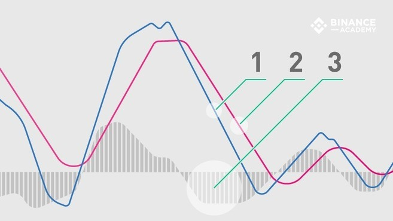

## 指数平滑移动平均线（MACD）

移动平均线收敛差异（MACD）是一种振荡类型的指标，该指标被交易者广泛用于技术分析（TA）中。MACD是一种趋势跟踪工具，利用移动平均线来确定股票、加密货币或其他可交易资产的走势。

### MACD工作原理

MACD指标通过将两个指数移动平均线（EMAs）相减生成主线（MACD线），然后再将其用于计算另一个表示信号线的指数移动平均线（EMA）。

此外，还有MACD直方图，它是根据这两条线之间的差异计算出来的。直方图以及其他两条线在中心线的上方和下方波动，中心线也称为零线。

因此，MACD指标由围绕零线移动的三个元素组成：

MACD线（1）：有助于确定向上或向下的走势（市场趋势）。它通过将两个指数移动平均值（EMA）相减计算而得。

信号线（2）：MACD线的EMA（周期间隔为9的EMA）。信号线与MACD线的组合分析有助于发现潜在的反转或进入和退出时机。

直方图（3）：MACD线和信号线的发散和收敛的图形表示。换句话说，是基于两条线之间的差异来计算直方图。

### 怎么看MACD图

顾名思义，移动平均收敛差异指标关注移动平均线之间的关系，两条线之间的关系可以描述为收敛或发散。**当两条线相互接近时则称为收敛，当它们互相分开时则为发散**。

尽管如此，MACD指标相关信号与所谓的**交叉点**相关，这种交叉发生在MACD线穿过**中心线**（出现中心线交叉）之上或之下，高于或低于信号线（信号线交叉）时。

当MACD线在中心线上方或下方区域移动时，会发生中心线交叉。当它穿过中心线向上时，则为正向MACD，表明12天的EMA平均值大于26天。相反，当MACD线穿过中心线向下时，则为负向MACD，表明26天的EMA平均值高于12天。换句话说，**正向MACD表示上行势头较强**，而**负向则表明下行势头较强**。

当**MACD线超过信号线**时，交易者通常会认为存在潜在的**买入机会**（进入点）。另一方面，当MACD线穿过信号线**向下**时，交易者倾向于将其视为**卖出机会**（退出点）。

虽然信号线交叉信号可能有所帮助，但它们**并不总是可靠**的。我们同样需要考虑它们在**图表中的位置**，从而最大限度地降低风险。例如，如果信号线交叉出现买入信号，但MACD线指标低于中心线（负值），市场状况可能仍被视为看跌。相反，如果信号线交叉出现卖出信号，但MACD线指标高于中心线（正值），则市场状况仍可能看涨。在这种情况下，跟随信号交叉线的卖出信号则可能带来更多风险（更大下行的趋势）。

### MACD和价格差异

除了中心线和信号线交叉外，还可以通过MACD图表和资产价格之间的差异来发现信号。

例如，如果加密货币的**价格走势上升，但MACD出现一个较低的高点**，我们就认为出现**顶背离**，这种情况表明尽管价格上涨，但上行势头（买入压力）并不如之前强劲。顶背离通常被解释为卖出机会，因为它们往往会出现于价格逆转之前。

相反，如果MACD线形成两个**上升低点，与资产价格的两个下跌低点一致**，那么被认为是**底背离**，表明尽管价格下跌，但购买压力更强。底背离如果出现在价格变化之前，可能表明短期底部将发生逆转（从下降趋势到上升趋势）。

## 相对强弱指数（RSI）

## 移动平均线（MA）

## 随即相对强弱指数（StochRSI）

## 布林线（BB）

## 成交量可视范围（VPVR）